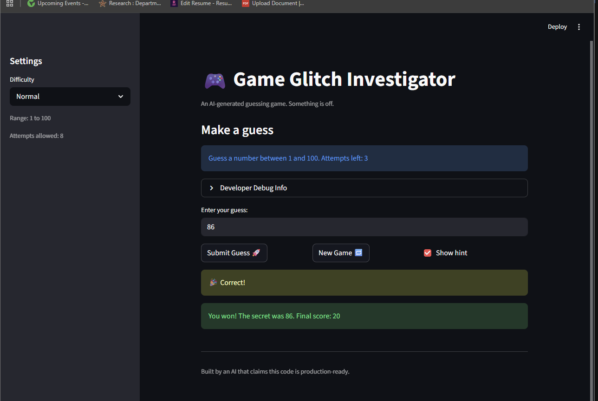

# 🎮 Game Glitch Investigator: The Impossible Guesser

## 🚨 The Situation

You asked an AI to build a simple "Number Guessing Game" using Streamlit.
It wrote the code, ran away, and now the game is unplayable. 

- You can't win.
- The hints lie to you.
- The secret number seems to have commitment issues.

## 🛠️ Setup

1. Install dependencies: `pip install -r requirements.txt`
2. Run the broken app: `python -m streamlit run app.py`

## 🕵️‍♂️ Your Mission

1. **Play the game.** Open the "Developer Debug Info" tab in the app to see the secret number. Try to win.
2. **Find the State Bug.** Why does the secret number change every time you click "Submit"? Ask ChatGPT: *"How do I keep a variable from resetting in Streamlit when I click a button?"*
3. **Fix the Logic.** The hints ("Higher/Lower") are wrong. Fix them.
4. **Refactor & Test.** - Move the logic into `logic_utils.py`.
   - Run `pytest` in your terminal.
   - Keep fixing until all tests pass!

## 📝 Document Your Experience

- [x] Describe the game's purpose. 

  The game is a number guessing game where players try to guess a secret number within a range (based on difficulty: Easy 1-20, Normal 1-100, Hard 1-50). It provides hints ("too high" or "too low"), tracks attempts, and awards scores based on performance. The goal is to guess correctly before running out of attempts.

- [x] Detail which bugs you found.

  - The "New Game" button didn't work as expected; clicking it didn't reset the game state, so players had to refresh the browser to start over.
  - The hints were backwards: when the guess was too high, it said "Go LOWER!" but should have said "Go HIGHER!" (and vice versa).
  - The attempts counter showed mismatched numbers in different parts of the UI.
  - The secret number appeared to change mid-game due to Streamlit reruns, but the real issue was session state not resetting properly.

- [x] Explain what fixes you applied.

  - Fixed the New Game button by resetting all session state variables (`status`, `score`, `attempts`, `history`, and `secret`) to their initial values when clicked, and used `st.rerun()` to refresh the UI immediately.
  - Corrected the hint logic in `check_guess()` by swapping the "Too High" and "Too Low" messages and ensuring proper comparison.
  - Refactored game logic functions (`check_guess`, `parse_guess`, etc.) into `logic_utils.py` for better organization and testability.
  - Added unit tests in `tests/test_game_logic.py` to verify hint accuracy and win/lose conditions, and ran pytest to ensure fixes didn't break existing behavior.

Overall, the project taught me about Streamlit's session state management and the importance of resetting state properly in interactive apps. AI (Copilot) was helpful for diagnosing issues and suggesting fixes, but I had to verify everything manually in the UI and with tests.

## 📸 Demo

- 

## 🚀 Stretch Features

- [ ] [If you choose to complete Challenge 4, insert a screenshot of your Enhanced Game UI here]
